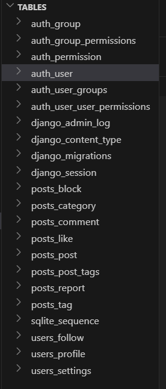
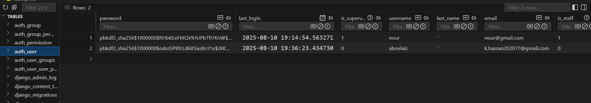
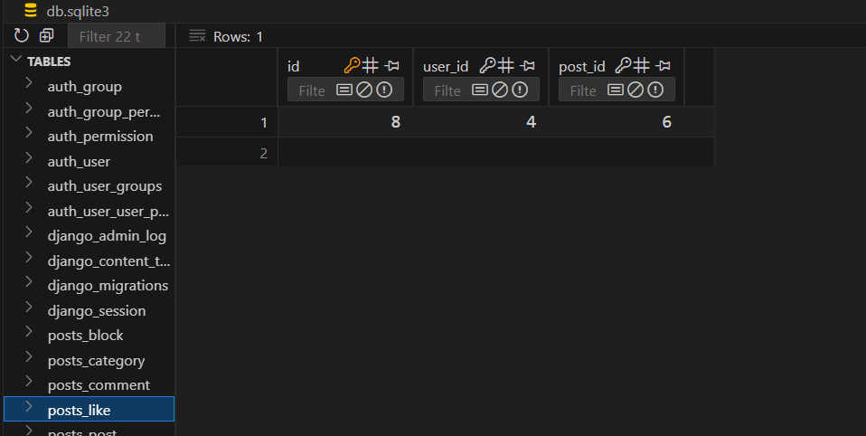
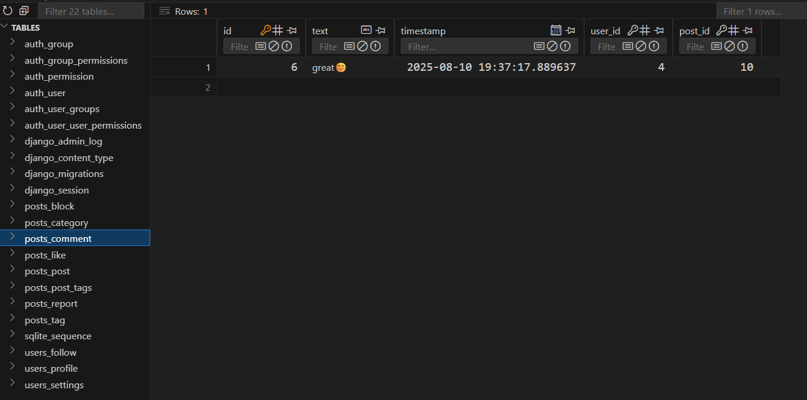

# SocialHub - Django Social Media Platform

SocialHub is a comprehensive social media application built with Django 5.2+, designed as a mini Facebook-like platform. It provides users with a complete social networking experience including user profiles, post sharing, social interactions, and privacy controls.

## 🚀 Project Overview

SocialHub is a full-featured social media platform that allows users to connect, share content, and interact with each other in a secure and user-friendly environment. The application follows Django best practices and implements modern web development patterns.

## ✨ Key Features

### User Management
- **User Registration & Authentication**: Complete signup/login system with email verification
- **Password Recovery**: Secure password reset functionality via email
- **User Profiles**: Customizable profiles with bio, avatar, and personal information
- **Privacy Settings**: Granular privacy controls (public, friends only, private)
- **User Blocking System**: Block/unblock functionality for user safety

### Social Features
- **Follow System**: Follow/unfollow other users to build your network
- **Post Creation**: Rich post creation with text, images, categories, and tags
- **Interactive Engagement**: Like/unlike posts with real-time AJAX updates
- **Comment System**: Threaded commenting on posts
- **Post Sharing**: Share posts within the platform
- **Content Organization**: Categorize and tag posts for better discovery

### Technical Features
- **Responsive Design**: Bootstrap-powered responsive UI for all devices
- **Image Handling**: Pillow integration for image uploads and processing
- **Real-time Updates**: AJAX-powered interactions for seamless user experience
- **Email Notifications**: Configurable email notifications for user activities
- **Custom Error Pages**: Professional 404 and error handling

## 🏗️ Architecture

The application is organized into modular Django apps:

### Apps Structure
- **`users`**: Handles user profiles, authentication, following system, and privacy settings
- **`posts`**: Manages posts, comments, likes, categories, tags, and sharing functionality
- **`core`**: Contains base templates, static files, and shared utilities
- **`config`**: Django project settings and URL configuration

### Technology Stack
- **Backend**: Django 5.2.5
- **Database**: SQLite (development) / PostgreSQL (production ready)
- **Frontend**: Bootstrap 5, HTML5, CSS3, JavaScript
- **Image Processing**: Pillow
- **Environment Management**: python-decouple
- **Authentication**: Django's built-in authentication system

## 🛠️ Installation & Setup

### Prerequisites
- Python 3.8+
- pip (Python package manager)
- Virtual environment (recommended)

### Quick Start

1. **Clone the Repository**
   ```bash
   git clone <repository-url>
   cd socialapp
   ```

2. **Create Virtual Environment**
   ```bash
   python -m venv venv
   source venv/bin/activate  # On Windows: venv\Scripts\activate
   ```

3. **Install Dependencies**
   ```bash
   pip install -r requirements.txt
   ```

4. **Environment Configuration**
   Create a `.env` file in the project root:
   ```env
   SECRET_KEY=your-django-secret-key-here
   DEBUG=True
   EMAIL_HOST=smtp.gmail.com
   EMAIL_PORT=587
   EMAIL_USE_TLS=True
   EMAIL_HOST_USER=your-email@gmail.com
   EMAIL_HOST_PASSWORD=your-app-password
   ```

5. **Database Setup**
   ```bash
   python manage.py makemigrations
   python manage.py migrate
   ```

6. **Create Superuser (Optional)**
   ```bash
   python manage.py createsuperuser
   ```

7. **Run Development Server**
   ```bash
   python manage.py runserver
   ```

8. **Access the Application**
   Open your browser and navigate to `http://127.0.0.1:8000/`

## 📱 Usage

### For Users
1. **Register**: Create a new account with email verification
2. **Profile Setup**: Complete your profile with bio and avatar
3. **Connect**: Follow other users and build your network
4. **Share**: Create posts with images, categories, and tags
5. **Engage**: Like, comment, and share posts from your network
6. **Privacy**: Configure your privacy settings and manage blocked users

### For Administrators
- Access the Django admin panel at `/admin/`
- Manage users, posts, and platform settings
- Monitor user activities and content moderation

## 🎥 Demo & Screenshots

### Video Demo
Watch the complete application walkthrough:

[🎥 View Demo Video](https://drive.google.com/file/d/1RPq0BzlVitiffllbu1ZflVoHB5t0nR8z/view?usp=drive_link)

*The video demonstrates user registration, profile setup, post creation, social interactions, and all key features of SocialHub.*

### Database Schema
Here's an overview of the main database tables and their relationships:



### Sample Data Screenshots

#### User Authentication Table

*Shows the user management system with authentication details*

#### Posts Table

*Displays the post creation system with content, categories, and metadata*

#### Likes System

*Shows the like/unlike functionality and user engagement tracking*

#### Comments System

*Demonstrates the commenting system with threaded discussions*

## 🔧 Configuration

### Email Settings
For email functionality (password reset, notifications):
- Use Gmail with App Password for development
- Configure SMTP settings in `.env` file
- Ensure 2FA is enabled on your Gmail account

### Media Files
- User uploads are stored in `media/` directory
- Configure `MEDIA_ROOT` and `MEDIA_URL` in settings
- For production, use cloud storage (AWS S3, etc.)

### Static Files
- Static files are served from `static/` directory
- Run `python manage.py collectstatic` for production


## 🤝 Contributing

1. Fork the repository
2. Create a feature branch (`git checkout -b feature/amazing-feature`)
3. Commit your changes (`git commit -m 'Add amazing feature'`)
4. Push to the branch (`git push origin feature/amazing-feature`)
5. Open a Pull Request

---


Enjoy SocialHub!